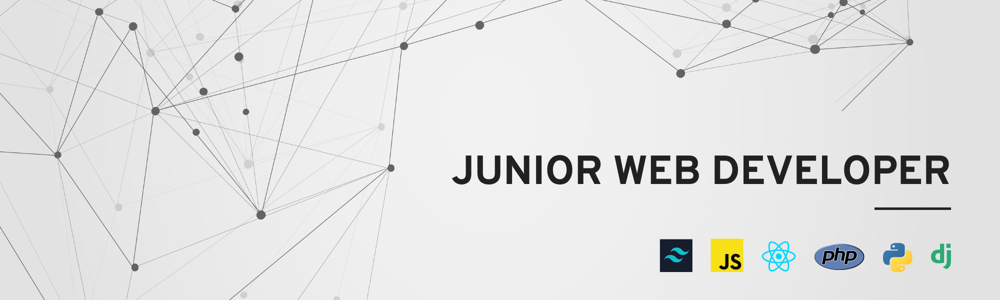

  

 

I'm a developer with a passion for web development and data processing technologies.
During my studies, I was able to discover the world of coding with R and data processing combined with biostatistics. After my studies, I started to learn Python on my own, and it was a real revelation for me. I wanted to turn my passion into my profession. 

So I decided to retrain in the world of web development, using the classic programming languages Javascript and PHP  at [BeCode](https://becode.org/fr/apprendre/developpeur-web-junior/). During this transition, I was able to complete a few months' internship at [I-care](https://www.icareweb.com/fr/) as a data engineer. During this internship, I was able to consolidate my skills in Python and learn about data engineering and NLP techniques. 

I'm currently perfecting my fullstack skills in React/TS and Python in collaboration with NX_academy. I develop solutions for frontend/fullstack projects. In addition, I have two junior developers under my wing with whom I'm working to build their skills in React and the JavaScript environment. 

Thanks to a few years working alongside senior developers and my self-taught work, I've been able to acquire a solid grounding in various technologies. 

- Development tools: 
- Frontend technologies: 
- Backend technologies: 
- Database: 
- Testing technologies: 
- Libraries for data exploration and ML:

Alongside these technical skills, I've obviously been working on my soft-skills. Namely, teamwork, public speaking, code popularization, solution-oriented thinking, and so on.

Let's keep in touch for more information or future collaboration 😊! Take a look at my [portfolio](https://calcagno-loic.netlify.app/) to discover my world and the projects I've worked on.

  &nbsp;&nbsp;&nbsp;&nbsp;&nbsp;&nbsp;
  

 

<h1 align="center">My summary cards</h2>

<h2>My GitHub Stat Trophies</h2> 

  

<h2>My most used languages and stat cards</h2> 

   
   

<h2>My wakatime summary card</h2>

<!-- > These times correspond to the time interval between 1 February 2022 and today

 -->

  

