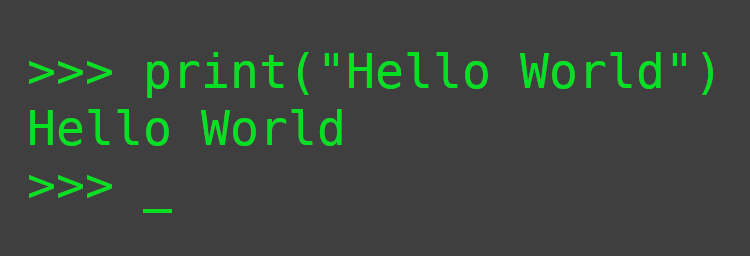

  

<h1 align="center">About me</h1>

Hey, welcome to my Github profile 

After 7 months of intensive training at [becode](https://becode.org/fr/apprendre/developpeur-web-junior/) and 3 months of internship at [I-care](https://www.icareweb.com/fr/), I'm looking for a job as a Developer Junior.

During the training, I was confronted with various frontend and backend issues. I went towards the backend and in particular Python. During my internship, I was able to deepen my knowledge with a project focused on data engineering. My job was to create a data pipeline to send only updated data to the database. An artificial intelligence implementation was also added to the pipeline. I was also able to do some cybersecurity with Google autenthification.

  &nbsp;&nbsp;&nbsp;&nbsp;&nbsp;&nbsp;
  

<h1 align="center">My tech skills</h1>

> Below you can find the different languages and tools I use in my work : 

<table>
  <tr>
    <td align="center" width="96">
      
       Git
    </td>
    <td align="center" width="96">
      
       Github
    </td>
    <td align="center" width="96">
      
       Stackoverflow
    </td>
    <td align="center" width="96">
      
       VScode
    </td>
    <td align="center" width="96">
      
       Pycharm
    </td>
    <td align="center" width="96">
      
       Markdown
    </td>
    <td align="center" width="96">
      
       HTML
    </td>
    <td align="center" width="96">
      
       CSS
    </td>
    <td align="center" width="96">
      
       SASS
    </td>
  </tr>
  <tr>
    <td align="center" width="96">
      
       Bootstrap
    </td>
    <td align="center" width="96">
      
       Tailwind
    </td>
    <td align="center" width="96">
      
       Javascript
    </td>
    <td align="center" width="96">
      
       PHP
    </td>
    <td align="center" width="96">
      
       MySQL
    </td>
    <td align="center" width="96">
      
       SQLite
    </td>
    <td align="center" width="96">
      
       R
    </td>
    <td align="center" width="96">
       
       Python
    </td>
    <td align="center" width="96">
      
       Django
    </td>
  </tr>
</table>

<h1 align="center">My summary cards</h2>

<h2>My GitHub Stat Trophies</h2> 

  

<h2>My most used languages and stat cards</h2> 

   
   

<h2>My profile summary card</h2> 

   

